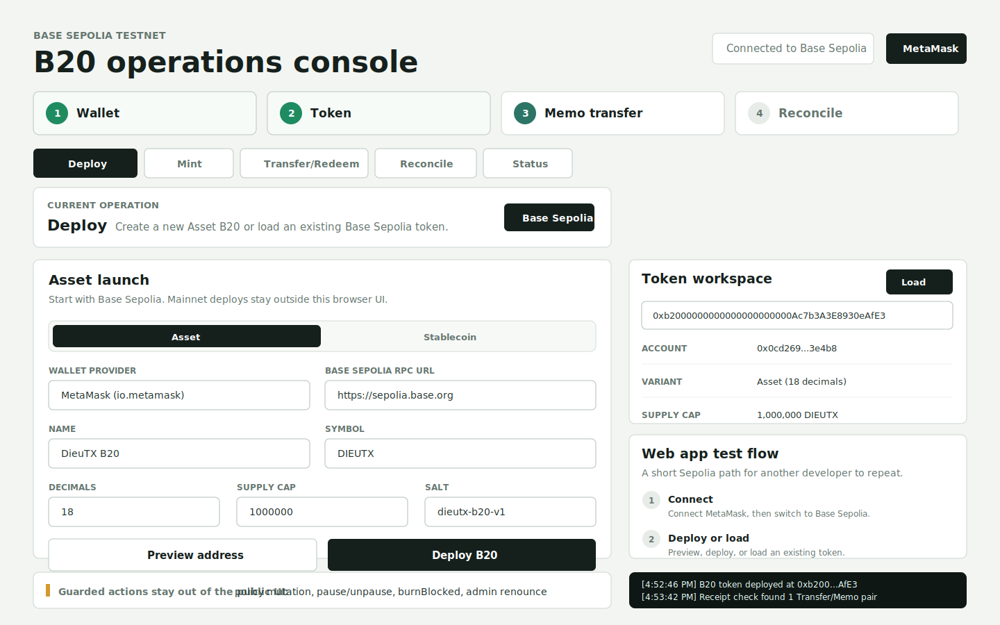

# Base B20 Wallet Deployer



Deploy a Base B20 token from GitHub Codespaces using a browser wallet. The app defaults to MetaMask when it is available, but OKX and other injected wallets also work.

No private key is needed in Codespaces.

## Editable Defaults

These values are only defaults. Change them in the app before deploying.

- Name: `DieuTX B20`
- Symbol: `DIEUTX`
- Network: Base Sepolia
- Decimals: `18`
- Supply cap: `1,000,000`
- Initial mint: `1,000`
- Salt: `dieutx-b20-v1`

Change the salt when creating a new token with the same wallet on the same network.

If you already deployed with a wallet and salt, the same address is already used. Mint from the existing token, or change **Salt** before deploying a new token.

## Quick Start

1. Open `https://github.com/dieutx/base-b20`.
2. Click **Code** -> **Codespaces** -> **Create codespace on main**.
3. In the Codespaces terminal:

```bash
npm install
npm run dev
```

4. Open **Ports** -> `5173` -> **Open in Browser**.
5. Use a real browser with MetaMask installed. Do not use the IDE Simple Browser.
6. In the app:
   - keep MetaMask selected, or choose another wallet
   - click **Connect wallet**
   - click **Base Sepolia**
   - edit token fields if needed
   - click **Preview**
   - click **Deploy B20** and sign in the wallet
   - click **Mint with memo** if you want a testnet issuance
   - use **Token workspace** to load an existing B20 token
   - use **Transfer / redeem** to preview a `PAYMENT` or `REDEEM` memo and send `transferWithMemo`
   - use **Governance snapshot** to read connected roles, policy IDs, and paused features
   - use **Receipt reconciliation** to verify adjacent Transfer/Memo event pairing

Your wallet needs Base Sepolia ETH for gas.

## Test Flow

Use this flow to test the app end to end on Base Sepolia:

The web app also shows these steps as **Web app test flow** cards at the top of the console.

1. **Connect wallet**: open the forwarded Codespaces URL in a normal browser with MetaMask, then connect.
2. **Switch network**: click **Base Sepolia** and approve the wallet prompt.
3. **Deploy or load token**: click **Preview**, then **Deploy B20**. If the token already exists, load it from **Token workspace**.
4. **Mint with memo**: set **Mint amount** and **Issuance reference**, then click **Mint with memo**. This calls `mintWithMemo` with a `MINT:v1:<reference>` memo hash.
5. **Transfer payment**: choose `PAYMENT`, enter recipient and amount, click **Preview memo**, then **Send with memo**. This calls `transferWithMemo`.
6. **Test redemption transfer**: choose `REDEEM` instead of `PAYMENT`, enter a redemption wallet address, then send with memo. This is a transfer-to-redemption flow, not a burn.
7. **Reconcile receipt**: after a transaction confirms, keep or paste the tx hash in **Receipt reconciliation** and click **Check receipt**. The checker pairs each `Memo` only with the immediately previous `Transfer`.
8. **Read governance state**: click **Refresh** in **Governance snapshot** to inspect roles, policy IDs, and paused features.

`BURN` and `POLICY` memos are visible as guarded workflows only. The browser UI does not expose burn, policy mutation, pause, or freeze/seize buttons.

## Safe UI Scope

The browser app opens as a realistic Sepolia test console. It exposes safe user/operator actions only:

- deploy Asset B20 on Base Sepolia
- mint with `MINT` memo from the connected minter wallet for testnet/dev use
- inspect token identity, supply, cap, variant, roles, policies, and pause state
- send `transferWithMemo` for `PAYMENT` and `REDEEM` transfer flows
- reconcile a receipt by matching each `Memo` with the immediately previous `Transfer`

It intentionally does not expose public buttons for role grants, policy attach/update, pause/unpause, admin renounce, or `burnBlocked`. Those are sensitive governance operations and belong in protected CLI/runbook flows under `docs/b20/`.

## RPC Troubleshooting

If MetaMask shows `Requested resource not available` or `RPC endpoint returned too many errors`:

1. Paste a reliable Base Sepolia RPC into **Base Sepolia RPC URL**.
2. Click **Add/Switch Base Sepolia** again.
3. If MetaMask still uses a broken RPC, open MetaMask network settings and update the Base Sepolia RPC there.

The app can ask the wallet to add or switch networks. It cannot force MetaMask or OKX to replace an RPC URL that is already saved in the wallet.

Public default:

```text
https://sepolia.base.org
```

A Chainstack Base Sepolia endpoint can also be used.

## CLI Fallback

Only use this if you intentionally want a private-key workflow.

```bash
curl -L https://raw.githubusercontent.com/base/base-anvil/HEAD/foundryup/install | bash
base-foundryup --install v1.1.0
base-forge install base/base-std --no-git
cp .env.example .env
```

Fill `.env`, then:

```bash
source .env
base-cast balance "$ACCOUNT_ADDRESS" --rpc-url "$RPC_URL"
base-forge script script/CreateToken.s.sol --rpc-url "$RPC_URL" --private-key "$PRIVATE_KEY" --broadcast
```

Never commit `.env`, private keys, seed phrases, or private RPC credentials.

## B20 Operations Toolkit

See `docs/b20/` for production-oriented config, payment reconciliation, issuance/redemption, policy, freeze, and mainnet runbooks.

Useful commands:

```bash
npm run b20:install
npm run b20:preflight:sepolia
npm run b20:deploy:sepolia
npm run b20:smoke:sepolia
npm run b20:plan:mainnet
```

Mainnet deploy is plan-only in this repo. Do not broadcast mainnet from the CLI fallback.

## References

- Base B20 guide: https://docs.base.org/get-started/launch-b20-token
- Chainstack guide: https://docs.chainstack.com/docs/base-tutorial-deploy-a-b20-token
- Base standard library: https://github.com/base/base-std
